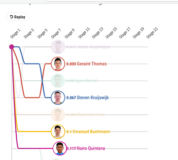
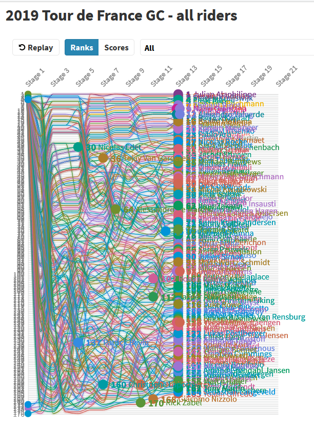

# Reflection 2/8/21

I looked up "visualizations Tour de France" on Google 
and checked out the top hits, including on from
r/datavis. The visualizations I chose were a set of 
10 visualizations from [Cycling News](https://www.cyclingnews.com/features/2019-tour-de-france-in-10-interactive-charts/)
. 

The first showed standings by stage:

What's nice about the visualizations is how simple
and interactive it is. It allows the user to replay
the race from the beginning, and to move backward and forward
in the timeline by clicking along it (a vertical bar
shows where the mouse is). One can also select one or
more riders to highlight, while the others fade. This works
exactly the way one would expect: clicking a rider highlights them and fades everyone else;
clicking another rider highlights them too; unclicking a rider unhighlights them;
if all riders are unclicked all become bright again. Interaction and 
especially intuitive interaction make visualizations a lot more fun
to explore. A couple things
that might be clearer are what the number by the riders names mean, and making the
color scheme carry information - right now it's bright and fun, 
but doesn't seem to correspond to any meaning.

Another visualization on the page shows the ranks of all riders:

Similarly to the first one, this one shows rank across the stages, and can be
replayed or clicked to a specific stage. The user can sort
by ranks or scores. Because there's so much information, users can see 'All' or choose
a specific rider to look at from a drop-down menu; they can also click on riders
to highlight and fade them the same way as above. This ability to see everything or isolate
one or more riders allows the user to focus on whatever they are most interested in. It 
can be hard, however, to select a particular line - I wonder if they could have made regions
correspond to the lines, as in the 'Data is a search space' talk, so that the lines had
larger hoverable/clickable areas. Another nice thing would be having a button to clear all selections/reset
to the original visualization after playing around with viewing different riders. As with the previous,
color is bright and fun, but could be made more meaningful. 

The rest of the visualizations on the page are also fun to interact with. 
Some visualizations on this topic that I didn't choose, however were visualizations 
that were [static](https://medium.com/@wenjun.sarah.sun/visualizing-mountain-and-flat-stages-in-tour-de-france-cde227e98145) (interesting information but more
boring to explore), too [hard to see](https://cyclingtips.com/2019/07/visualising-the-2019-tour-de-france/) (not as interactive/filterable as the site
above, even though a lot of information is presented), and where it wasn't easy to find the 
visualization itself for all the [narrative](https://www.behance.net/gallery/72687679/Tour-De-Drugs-Data-Narrative) (although
this one was interesting because it did describe so much of the process
before the visualization is final; and pointed out that there are visualization
awards, which would be a good place to check out high quality visualizations).