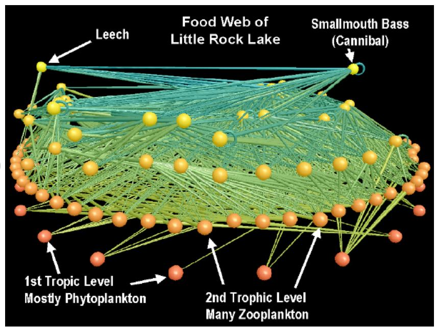

# Reflection 2/15/21

I first looked up "visualizations of food webs" to see how these
are being visualized. I found a [2005 paper](https://www.researchgate.net/publication/221000766_Interactive_3D_visualization_of_highly_connected_ecological_networks_on_the_WWW),
 "Interactive 3D visualization of highly connected ecological networks on the WWW" by Yoon et al., which describes
how 2D visualizations of food webs obstruct understanding, and 
then investigates interactive 3D visualizations of food webs. For example, compare
 the following images of
a 2D food web and a snapshot of an interactive 3D web:

  

The paper describes "visualizations of food webs that use intuitive node placement, minimal edge-crossing and link length, 
hierarchical node aggregation, and analysis tool integration." Other papers describe
the benefits of [interactivity](https://static1.squarespace.com/static/53ef7f3be4b07998dc387a48/t/56aa040205f8e2f782087f12/1453982733091/2016+Pocock_et_al+Network+visualisation.pdf)
 in food web visualizations, and how
food webs can be represented as [networks](https://kakearney.github.io/2016/01/19/food-webs-as-network-graphs-1.html). 
This indicates that the data (the 'what') in food webs consists generally of links
forming network data structures, where the links and nodes have associated attributes
(e.g. species type, population). The researchers argument for interactivity to
help people better understand ecosystems implies that the main 'why' of these visualizations
may be discovery (whereas simple static versions are often used for
presentation in classes). Within discovery there may be multiple lower-level
functions; I could imagine a scientist looking-up, locating, exploring, etc. 

Visualizing food webs in 3D vs 2D also made me curious about whether
people make visualizations for higher dimensions (4D+), and
how they might do that (movement, color-mapping, other?). I found
a brief [mathematical introduction](http://eusebeia.dyndns.org/4d/vis/01-intro)
 to visaulization of 4D objects, which discussed
multiple possibilities for visualizing a 4D cube. One example is
different ways of projecting into 3D space (or rather, 2D representations
of 3D space):

I'm curious to learn more about this topic.
