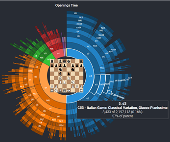
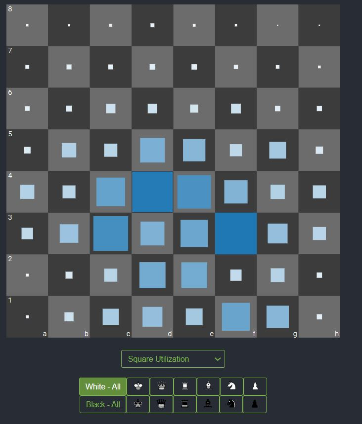
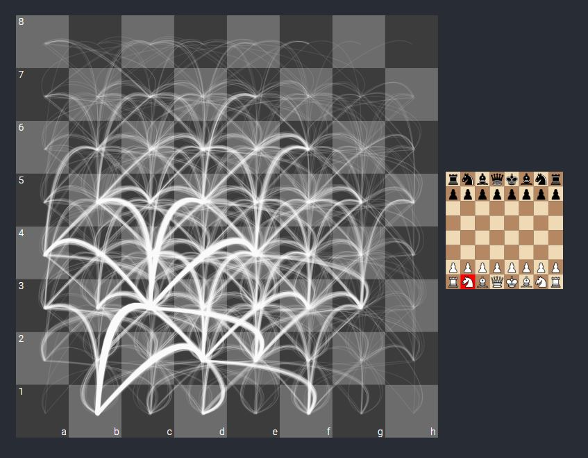

# Reflection 2/22/21

This week I looked at visualizations of chess, because
I was curious how movement data could be portrayed in different ways. I found
a [site](https://blog.ebemunk.com/a-visual-look-at-2-million-chess-games/)
 with around 10 different visualizations of 2 million
chess games pulled from the MillionBase database of chess games.

These visualizations ranged from the most general summaries (eg. black win,
 white win, draw) to more interesting visualizations. The three
 most interesting ones were one showing openings, one showing
 square usage, and one showing piece movement. 
 
 

The graph above is a graph of chess opening moves. It uses color in two
ways: by hue to show different opening moves, and by shade within each hue
to show white vs. black. Since there are only 2 players moving - white & black -
these two uses of color are coherent. If this was a game involving more players,
more shades of each color could have been used and probably would work up to some
small number of players (4? 10?). The graph uses pie chart angle to show the most
popular openings, then a tree hierarchy to show the most popular following moves.
The viewer can mouse-over any segment of the chart and view a popup
describin that series of moves, the number and percent of times it was played,
and whether it has a formal name (e.g. Sicilian Defense: Accelerated Dragon, 
Modern Variation). 

This heat map visualization shows how often squares on the board were
used for certain things. It offers the viewer many options to filter by: all white
pieces, all black pieces, an individual black or white piece, and by choice 
of square use, moved-from squares, capture squares, and checking squares. 
This ability to filter allows users to examine pieces and squares they
are most interested in. Particularly, it allows the user to lookup (by
piece and square), locate by selecting a piece and looking at an area of interest,
 and explore. It does not allow the user to browse by selecting a location 
 and viewing how the different pieces move there.
 Luminance (fading to whte) and size were used to redundantly encode
how often the square was used. This use of luminance to show 
numerical order is an appropriate use of that color channel. 

The third interesting visualization is a visualization that 
is more artistic in appearance. It uses thickness of lines
to show how often pieces made certain moves (cutoff at 1000 moves or more).
It allows the user to select a piece to see its moves. The
data portrayed could be thought of as items with attributes (frequent moves)
 or as paths with attributes (which pieces take them). As
 a datastructure this could be placed in a table or in a network/tree
 structure, which is closer to what is shown in the vis. 
 
 I enjoyed these visualizations because they presented both high-level summary
 and more detailed data about chess games, with a range from very
 basic charts (pie chart, bar chart) to more complex ones. They
 also made clear that there are many different ways to view 
 and group the data. Any chart that has user interaction or an aspect
 of movement is automatically more interesting than those that don't.

One could use similar graphs to look at any type of movement, such as immigration. I 
looked up immigration visualizations, and found some that have a lot of info but are [static](https://migrationdataportal.org/blog/10-coolest-visualizations-migration-data),
and others
  that use [movement to show migration](http://metrocosm.com/global-migration-map.html)
 and
movement to show [migration over time](http://metrocosm.com/us-immigration-history-map.html). 