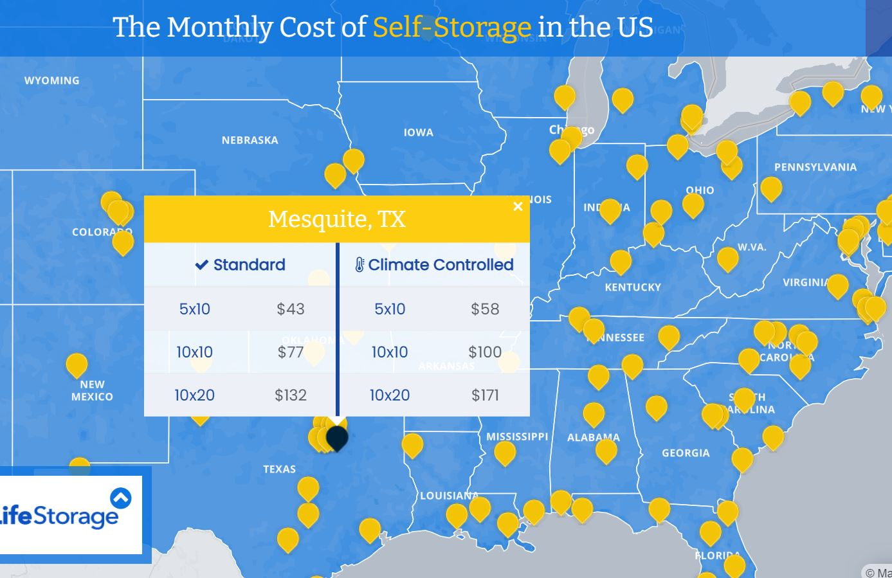

# Reflection 3/1/21

Happy March! 

This week I was curious about visualizations of self-storage unit
prices, because I just removed the last of my college belongings 
from storage. My motive in looking for these visualizations was thus
enjoyment and discovery. It was interesting looking for data in this 
sense because I am used to looking for data either for a very
particular purpose (e.g. a report) or at random (e.g. whatever pops up
or is trending), but in this case I was looking up visualizations to 
match the mood and topic I was interested in at the time. This reminded
me of the Dear Data website, where the authors talked about using data
and visualizations to be more aware of life; using data to make things
more real and personal - using data to pay more attention to something 
for its own sake rather than in order to do something else. 

I found a visualization showing average
storage prices for standard size storage units 
in various cities in the U.S., based on the four largest 
self-storage companies in the U.S. (Life Storage, CubeSmart,
Extra Space, and Public Storage):

This vis allows the user to lookup prices by city, browse by location,
and explore by clicking on various cities. It has a nice collapsible description window,
which explains where the data is from and how to use the map. It
allows the user to click on one city at a time to view its information. 
The data is tabular, although the geographic states are also shown.

Although this vis functions almost solely as a lookup tool, there are many changes that would allow it to present more information 
or enhance exploration. For example, one 
could make it easier to compare cities. Currently, someone has to click on
one city, remember what the prices are there, and click on another city to 
compare their information. Comparison could be made easier in a handful of
ways. One way might be to add another view where the user can select one
or more cities, and their information will be added to a table or chart for
comparison. Another way would be to add other views of the entire
range of information, such as a bar chart showing prices by city or state.
Showing the entire range of information would allow people to summarize
prices overall, or to get a sense of the trends throughout the country. 
Color could also be used - for example, saturation or luminence could
be used to encode the average price in a state. This would lend the
geographical aspect more meaning; currently the map only functions to allow
the user to easily find their city, rather than make any kind of 
geographic comparisons or relationships. More data or derived data
could be visualized - such as how pricing relates to population density,
or to number of units / companies in a city, or to availability of units. 
Of course, someone has to be curious about those things in order
to spend the time to make such a visualization. 